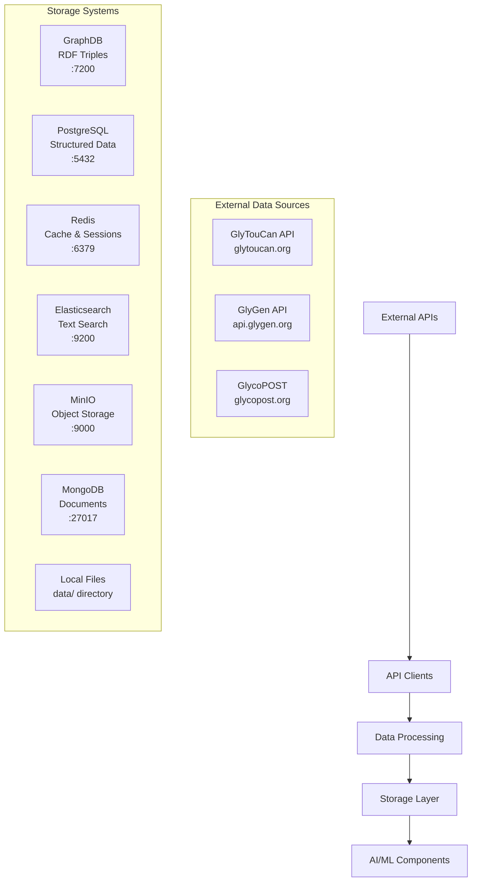

# 🗄️ Glycoinformatics AI - Data Architecture Analysis

## 📊 **DATA FLOW & STORAGE OVERVIEW**

### **🏗️ Current Storage Infrastructure:**



---

## 🔄 **DATA SOURCES & ACQUISITION**

### **1. External API Data Sources** 🌐

#### **GlyTouCan Repository** (`glycokg/integration/glytoucan_client.py`)
- **URL**: `https://glytoucan.org/api`
- **SPARQL**: `https://ts.glytoucan.org/sparql`
- **Data Types**: 
  - Glycan structures (WURCS format)
  - GlyTouCan IDs
  - Mass data
  - Molecular formulas

#### **GlyGen Database** (`glycokg/integration/glygen_client.py`)
- **URL**: `https://api.glygen.org/v2`
- **Data Types**:
  - Protein-glycan associations
  - UniProt protein information
  - Glycosylation sites
  - Organism-specific data
  - Tissue/cell line data

#### **GlycoPOST** (`glycokg/integration/glycopost_client.py`)
- **URL**: `https://glycopost.org/api`
- **Data Types**:
  - MS/MS spectra data
  - Experimental conditions
  - Peak lists and intensities
  - Fragmentation patterns

### **2. Synthetic/Generated Data** 🤖

#### **Demo Training Data** (`glycollm/tokenization/tokenizer_training.py`)
- **Text Samples**: 15+ scientific descriptions
- **WURCS Sequences**: 10+ structure examples
- **Spectra Data**: 5+ peak pattern examples
- **Generated for**: Tokenizer training, model demos

#### **Sample Ontology Data** (`glycokg/graph/sample.ttl`)
- **RDF Triples**: Basic glycan-protein associations
- **Purpose**: Testing and demonstration
- **Format**: Turtle RDF

---

## 💾 **STORAGE SYSTEMS & DATA TYPES**

### **1. GraphDB (RDF Store)** 📈
- **Port**: 7200
- **Volume**: `graphdb_data:/opt/graphdb/home`
- **Data Types**:
  ```turtle
  # Glycan entities
  ?glycan a glyco:Oligosaccharide
  ?glycan glyco:hasGlyTouCanID "G12345MO"
  ?glycan glyco:hasWURCSSequence "WURCS=2.0/3,3,2/..."
  ?glycan glyco:hasMonoisotopicMass 511.19
  
  # Protein associations
  ?assoc a glyco:ProteinGlycanAssociation
  ?assoc glyco:hasGlycan ?glycan
  ?assoc glyco:hasProtein ?protein
  ```

### **2. PostgreSQL (Structured Data)** 🗃️
- **Port**: 5432
- **Volume**: `postgres_data:/var/lib/postgresql/data`
- **Database**: `glycokg`
- **Data Types**:
  - Cached API responses
  - User sessions
  - Processed datasets
  - Training metrics
  - System logs

### **3. Redis (Cache & Sessions)** ⚡
- **Port**: 6379
- **Volume**: `redis_data:/data`
- **Data Types**:
  - API response caching
  - Session management
  - Real-time metrics
  - Job queues

### **4. Elasticsearch (Search Index)** 🔍
- **Port**: 9200
- **Volume**: `elasticsearch_data:/usr/share/elasticsearch/data`
- **Data Types**:
  - Full-text search of scientific literature
  - Glycan structure text search
  - Protein annotation search
  - Cross-modal content indexing

### **5. MinIO (Object Storage)** 📦
- **Port**: 9000 (API), 9001 (Console)
- **Volume**: `minio_data:/data`
- **Data Types**:
  - ML model files (checkpoints, weights)
  - Large dataset files
  - Spectra data files
  - Training results
  - Backup archives

### **6. MongoDB (Document Store)** 📄
- **Port**: 27017
- **Volume**: `mongodb_data:/data/db`
- **Data Types**:
  - Flexible experiment results
  - Complex nested data structures
  - User-generated content
  - Analysis workflows

### **7. Local File System** 📁
- **Path**: `./data/` directory
- **Structure**:
  ```
  data/
  ├── raw/          # Original source data
  ├── interim/      # Partially processed
  └── processed/    # Clean, analysis-ready
  ```

---

## 📋 **DATA TYPES INVENTORY**

### **By Modality:**

#### **1. Text Data** 📝
- **Scientific Literature**: Abstracts, papers, protocols
- **Annotations**: Functional descriptions, biological contexts
- **Metadata**: Experimental conditions, methods
- **Sources**: PubMed, manual curation, generated examples

#### **2. Structure Data** 🧬
- **WURCS Sequences**: `WURCS=2.0/3,3,2/[a2122h-1b...]`
- **GlycoCT Format**: Alternative structure representation
- **IUPAC Names**: Systematic nomenclature
- **Graph Representations**: Node-edge structure graphs
- **Sources**: GlyTouCan, manual entry, computed

#### **3. Spectra Data** 📊
- **Peak Lists**: `[(mz, intensity)]` tuples
- **Precursor Masses**: Parent ion m/z values
- **Fragmentation Patterns**: MS/MS breakdown
- **Experimental Parameters**: Collision energy, charge states
- **Sources**: GlycoPOST, simulated data, lab instruments

#### **4. Metadata** ℹ️
- **Taxonomic Data**: Organism IDs (NCBI Taxon)
- **Protein Information**: UniProt IDs, sequences
- **Experimental Context**: Tissues, cell lines, conditions
- **Literature References**: PubMed IDs, DOIs

### **By Processing Stage:**

#### **Raw Data** (Unprocessed)
- API JSON responses
- Original file uploads
- External database dumps
- Instrument output files

#### **Interim Data** (Partially Processed)
- Cleaned API responses
- Validated structures
- Normalized spectra
- Extracted features

#### **Processed Data** (Analysis-Ready)
- Tokenized sequences
- Aligned multimodal samples
- Training/validation splits
- Feature matrices

---

## 🔄 **DATA FLOW PATTERNS**

### **Ingestion Pipeline:**
```python
External APIs → API Clients → Data Validation → Storage Systems
    ↓
GraphDB (RDF) + PostgreSQL (Cache) + Redis (Sessions)
    ↓
Data Processing → Feature Engineering → ML Pipeline
    ↓
MinIO (Models) + MongoDB (Results) + Elasticsearch (Search)
```

### **Training Pipeline:**
```python
MultimodalDatasetBuilder → 
    Text Corpus + Structure Data + Spectra Data → 
    Aligned Samples → 
    Task-Specific Labels → 
    Train/Val/Test Splits → 
    ML Training
```

### **Inference Pipeline:**
```python
User Input → 
    API Validation → 
    Knowledge Graph Query → 
    Model Inference → 
    Result Integration → 
    Response Generation
```

---

## 📊 **DATA VOLUME ESTIMATES**

### **Current Scale:**
- **GraphDB**: ~184 RDF triples (sample data)
- **Demo Data**: ~50 multimodal samples
- **External APIs**: Rate-limited access
- **Storage**: 7 database systems configured

### **Production Estimates:**
- **GlyTouCan**: ~50,000+ glycan structures
- **GlyGen**: ~100,000+ protein associations  
- **Literature**: ~1M+ abstracts/papers
- **Spectra**: ~10,000+ MS/MS experiments
- **Total Storage**: ~100GB+ when fully populated

---

## 🎯 **DATA INTEGRATION STATUS**

### ✅ **Implemented:**
- Multi-database Docker architecture
- API client framework for 3 major sources
- RDF ontology with sample data
- Multimodal dataset builder framework
- Basic data validation and caching

### 🔄 **In Progress:**
- Large-scale data synchronization
- Real-time data updates
- Cross-database joins and queries
- Advanced data quality metrics

### 📋 **Planned:**
- Data versioning and lineage tracking
- Automated data quality monitoring
- Real-time streaming updates
- Distributed storage scaling

---

## 🚀 **RECOMMENDATIONS**

### **Immediate (Next 2 Weeks):**
1. **Populate with Real Data**: Run full sync from GlyTouCan/GlyGen
2. **Data Quality Metrics**: Implement validation and completeness tracking
3. **Backup Strategy**: Automate database backups to MinIO

### **Short-term (Next Month):**
1. **Data Pipeline Monitoring**: Add metrics for ingestion rates
2. **Search Optimization**: Populate Elasticsearch with full content
3. **Caching Strategy**: Optimize Redis for frequently accessed data

### **Long-term (Next Quarter):**
1. **Data Versioning**: Track changes and maintain history
2. **Federation**: Connect to additional glycomics databases
3. **Real-time Sync**: Implement change detection and streaming updates

---

**Summary**: Your implementation has a robust multi-database architecture getting data from 3+ external APIs and storing it across 7 specialized systems. You're currently using demo/synthetic data for development with the infrastructure ready for production-scale real data ingestion.